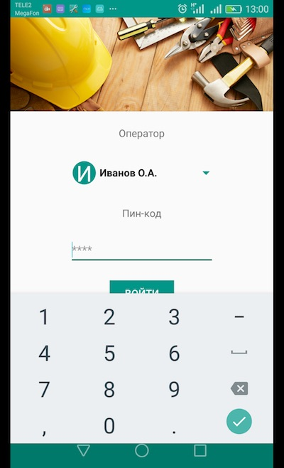

# ServiceMan
Программный комплекс Serviceman предназначен для сбора данных/показаний счетчиков, для автоматизации процесса съема показаний индивидуальных и общедомовых приборов учета воды. Задача сервера обеспечить интерфейс обмена данными с мобильными приложениями контроллеров (смартфоны с Android) через встроенный API, обеспечить хранение, обработку и визуализацию собранных данных. 

Мобильное приложение обходчика позволяет для каждого объекта вводить показания, комментарии, фиксировать неисправности, делать фотографии счетчиков и передавать собранные показания на сервер. 

